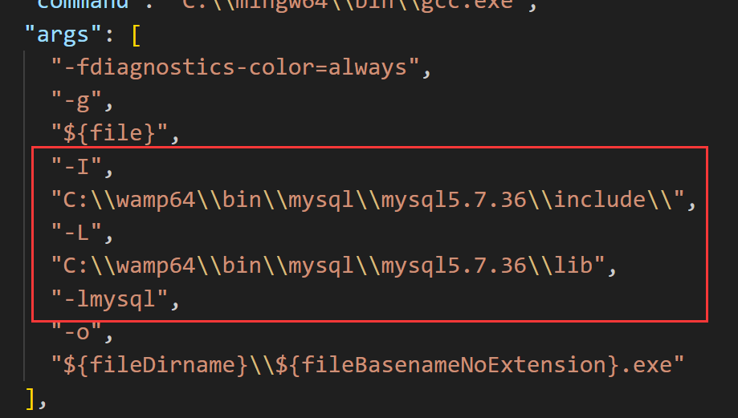
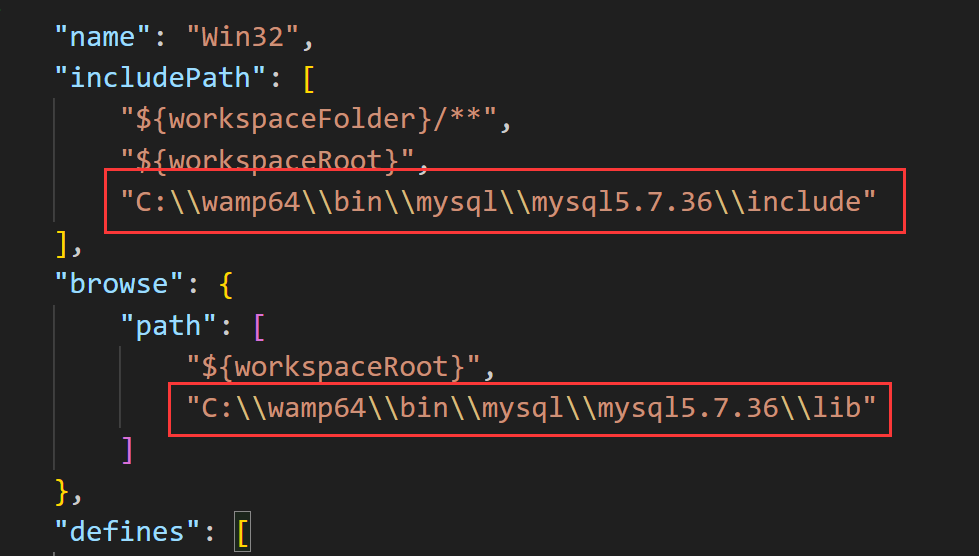

# VSCode C开发配置

## 1、开发mysql配置

### 1.1 tasks.json配置，在项目的.vscode目录中进行tasks.json 文件参数配置：

```
{
  "tasks": [
    {
      "type": "cppbuild",
      "label": "C/C++: gcc.exe build active file",
      "command": "C:\\mingw64\\bin\\gcc.exe",
      "args": [
        "-fdiagnostics-color=always",
        "-g",
        "${file}",
        "-I",
        "C:\\wamp64\\bin\\mysql\\mysql5.7.36\\include\\",
        "-L",
        "C:\\wamp64\\bin\\mysql\\mysql5.7.36\\lib",
        "-lmysql",
        "-o",
        "${fileDirname}\\${fileBasenameNoExtension}.exe"
      ],
      "options": {
        "cwd": "${fileDirname}"
      },
      "problemMatcher": [
        "$gcc"
      ],
      "group": {
        "kind": "build",
        "isDefault": true
      },
      "detail": "Task generated by Debugger."
    }
  ],
  "version": "2.0.0"
}
```



### 1.2 c_cpp_properties.json 配置，在项目的 .vscode 目录下配置 c_cpp_properties.json 文件参数：

```
{
  "configurations": [
      {
          "name": "Win32",
          "includePath": [
              "${workspaceFolder}/**",
              "${workspaceRoot}",
              "C:\\wamp64\\bin\\mysql\\mysql5.7.36\\include"
          ],
          "browse": {
              "path": [
                  "${workspaceRoot}",
                  "C:\\wamp64\\bin\\mysql\\mysql5.7.36\\lib"
              ]
          },
          "defines": [
              "_DEBUG",
              "UNICODE",
              "_UNICODE"
          ],
          "compilerPath": "C:\\mingw64\\bin\\gcc.exe",
          "cStandard": "c17",
          "cppStandard": "gnu++14",
          "intelliSenseMode": "windows-gcc-x64"
      }
  ],
  "version": 4
}
```




# 使用 Microsoft VS Code 配置C开发环境

### 1、安装MinGW64编译器
* 下载：https://sourceforge.net/projects/mingw-w64/files/
* MinGW-W64下载与安装：https://www.cnblogs.com/linying1991/p/12164039.html

<p>安装后，配置环境变量，将mingw文件下的bin目录添加了path中。</p>
<p>在cmd终端中输入 gcc -v 来检查是否成功安装。</p>

### 2、安装vscode 插件

* C/C++、Code Runner       

<p>（写c的插件，《c/c++》 《c++ intellisense》《code runner》，基本安装了这几个插件你就可以开始写了（或者你可以选择C/C++ Extension Pack套餐））</p>

## 3、配置编译器

<p>按快捷键Ctrl+Shift+P调出命令面板，输入C/C++，选择“Edit Configurations(UI)”进入配置。</p>

<p>这里配置两个选项： </p>

* 编译器路径：C:\mingw64\bin\g++.exe

* IntelliSense 模式：gcc-x64