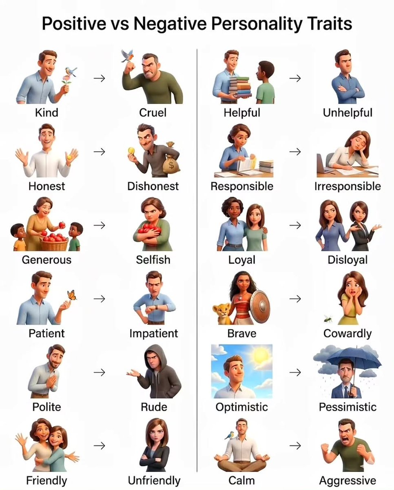
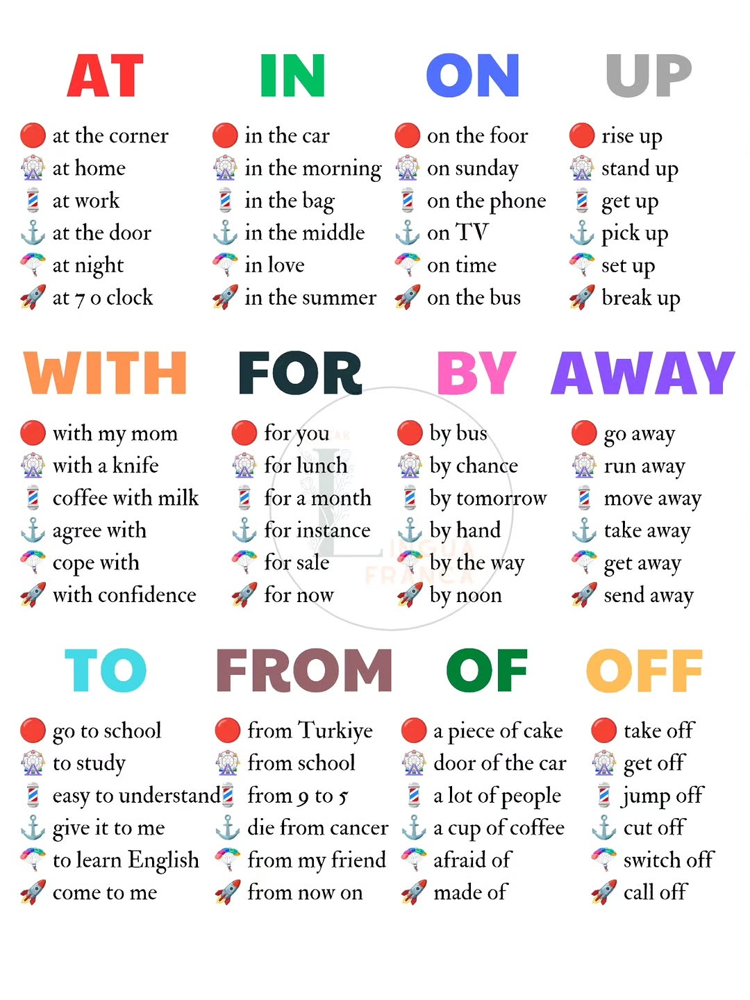

# Common elementary ELA vocabulary

---
* jewelry  /ˈdʒuːəlri/  n.珠宝，首饰

---
* trait  /treɪt/  n.（人的个性的）特征，特点；遗传特征；一点，少许
* positive  /ˈpɑːzətɪv/  adj.乐观的，有信心的；积极的，建设性的；良好的，有助益的；赞成的，支持的；确信的，肯定的；完全的，绝对的； n.优势，优点；阳性结果；正片；正极，阳极；正数；
* negative  /ˈneɡətɪv/  adj.有害的，负面的；悲观的，消极的；否定的，拒绝的；否定式的；（结果）阴性的；负极的，阴极的；负的，小于零的；亏损的；负像的，底片的； n.底片，负片；否定词，否定句；坏处，害处；阴性结果；（逻）（对命题的）否定；负电；负数  v.拒绝，否定；推翻，证伪；消除，抵消

---
* 常见prep.简词at、in、on、up、with、for、by、away、to、from、of、off 用法
