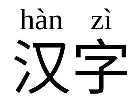
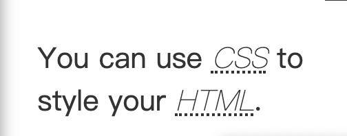

# HTML 有一个 `<ruby>` 标签，可以把读音放到文字上方。

* HTML `<ruby>` 元素 被用来展示东亚文字注音或字符注释。

```
<ruby>
汉字 <rp>(</rp><rt>han zi</rt><rp>)</rp>
</ruby>

<ruby>
  汉 <rp>(</rp><rt>han</rt><rp>)</rp> 字 <rp>(</rp><rt>zi</rt><rp>)</rp>
</ruby>

 <ruby> 明 日 <rp>(</rp><rt>ming ri</rt><rp>)</rp> </ruby>
 <ruby> 汉 <rt>Hàn</rt> 字 <rt>Zì</rt> </ruby>
```




# `<abbr>` 标签

<p>You can use <abbr title="Cascading Style Sheets">CSS</abbr> to style your <abbr title="HyperText Markup Language">HTML</abbr>.</p>

```
<p>You can use <abbr title="Cascading Style Sheets">CSS</abbr> to style your <abbr title="HyperText Markup Language">HTML</abbr>.</p>

css: 
abbr {font-style: italic;  font-weight: 100;}
```



[<abbr>: The Abbreviation element](https://developer.mozilla.org/en-US/docs/Web/HTML/Element/abbr)


# required属性和autofocus属性，labels属性

```
<form class="form-monochrome" data-turbo="false" role="form" action="/sessions" accept-charset="UTF-8" method="post">
  <input type="hidden" name="authenticity_token" value="bznK2FKKyAP_jXn75oGInLH3xB2P6hk7dbAldRtXqH0cOQ5mLoIOfaRtZmwCbGtEunirxlHLUNIzBuZcQcThYg" autocomplete="off" />
  <p>
    <label class="required" for="usr_name">Name</label>
    <input type="text" name="usr_name" id="usr_name" required="required" autofocus="autofocus" />
    <!--autofocus:当页面打开时，该控件自动获得光标焦点  -->
  </p>
  <div class="form-group">
    <label class="required" for="email">Email</label>
    <input placeholder="e.g. stkits@126.com" required="required" autofocus="autofocus" class="form-control" type="email" name="email" id="email" />
  </div>
  <div class="form-group">
    <label class="required" for="password">Password</label>
    <input placeholder="••••••••" required="required" maxlength="65" class="form-control" size="65" type="password" name="password" id="password" />
  </div>


  <input type="submit" />
  <!-- 提交按钮 -->
  <input type="reset" />
  <!-- 重置按钮 -->

  <button type="submit" block="true" class="btn btn-md btn-dark btn-block"><span>Login</span></button>
</form>
```

* required属性：在提交时，如果元素中内容为空白，则不允许提交，同时在浏览器中会弹出提示文字。

* autofocus属性：当页面打开时，该控件自动获得光标焦点。

* labels属性：为所有可用标签（label元素）的表单元素定义一个label属性，属性值为一个NodeList对象，代表该元素所绑定的标签元素所构成的集合。


# 5个改善用户体验的 HTML 属性

* hreflang、translate、reversed、controls、autocomplete

[5 HTML attributes for improved accessibility and user experience](https://www.htmhell.dev/adventcalendar/2023/4/)
